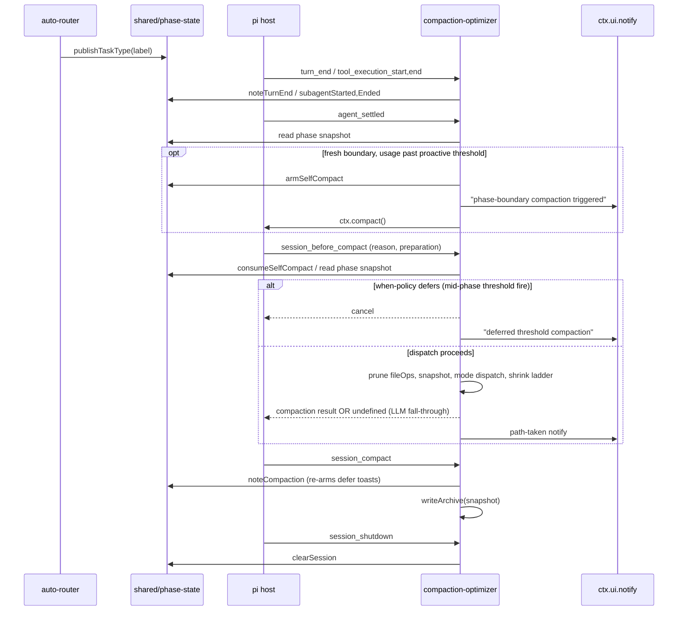
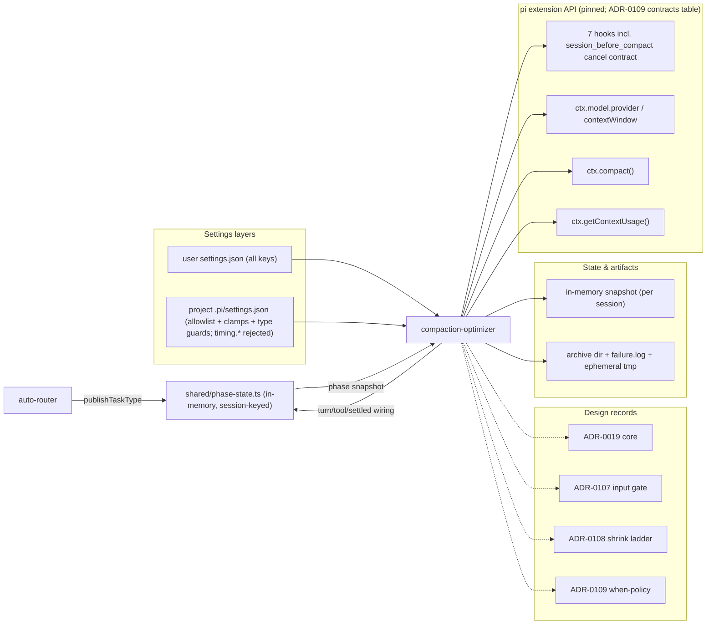
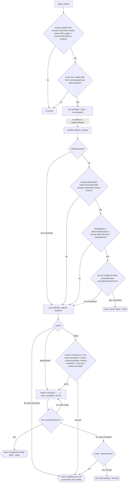

# compaction-optimizer

Pi extension that augments `/compact` with (1) bounded file-tracker pruning,
(2) a pre-compaction archive of the discarded turns, (3) a deterministic
LLM-free summary builder gated by a hybrid heuristic and bounded by an
output-side shrink ladder, and (4) a prefix-cache-aware **when-policy** that
defers mid-phase threshold compactions and triggers proactively at phase
boundaries (ADR-0109) — the extension owns compaction's *when* as well as
its *how*.

See [ADR-0019](https://github.com/psmfd/pi-config/blob/main/adrs/0019-compaction-optimizer-extension.md) for the
full design, threat model, and dissent record. This README is the operator-
facing surface.

## Install

```sh
pi install git:github.com/psmfd/pi-compaction-optimizer
```

Try it first without installing: `pi -e git:github.com/psmfd/pi-compaction-optimizer`.

## What it does

| Handler                  | Phase       | Behavior                                                                                            |
|--------------------------|-------------|-----------------------------------------------------------------------------------------------------|
| `session_before_compact` | pre-commit  | When-policy veto (ADR-0109), then prune `preparation.fileOps.read` in place; capture pre-cut payload to memory; dispatch by `mode`. |
| `session_compact`        | post-commit | Consume captured payload; write markdown archive under the configured root; record the compaction in phase-state and re-arm the deferral toasts. |
| `session_shutdown`       | teardown    | Clear this session's snapshot, when-policy phase state, and notify de-dup keys; sweep all process-tracked ephemeral archive roots. |
| `turn_end`               | when-policy signal | Advance the phase-state turn clock (see [Compaction timing](#compaction-timing--the-when-policy-adr-0109)). |
| `tool_execution_start`/`end` | when-policy signal | Track in-flight `subagent` fan-outs in phase-state (filtered on `toolName === "subagent"`). |
| `agent_settled`          | when-policy trigger | Proactive phase-boundary `ctx.compact()` when usage is past the proactive threshold at a fresh task-type boundary. |

When `mode` selects deterministic-style summarization (either explicitly via
`mode: "deterministic"`, or implicitly via `mode: "hybrid"` on a tool-call-
dense cluster), `session_before_compact` returns
`{ compaction: { summary, firstKeptEntryId, tokensBefore, details } }` and
pi's LLM summarizer is **skipped**. Otherwise it returns `undefined` and pi's
default `compact()` runs, consuming the pruned `fileOps` via
`computeFileLists()`. Pruning the upstream sets is the structurally correct
attachment point; see
ADR-0019 implementation notes on #208.

### Communication flow



## Architecture

What the extension depends on, and what depends on it:



## Modes

| Mode                       | Behavior                                                                                                                                              |
|----------------------------|-------------------------------------------------------------------------------------------------------------------------------------------------------|
| `hybrid` (default)         | Heuristic decision per call: deterministic build on tool-call-dense clusters, fall through to pi's LLM summarizer on chatty/planning/`/compact <instr>` cases. An exhausted shrink ladder (see below) also falls through. |
| `deterministic`            | Always run the LLM-free builder. `/compact <instructions>` are dropped with a one-time-per-session warning notify and a footer disclaimer on the summary. Air-gap guarantee: an over-budget stub is emitted with a warning, never LLM-routed. |
| `llm-only-with-dump`       | Never run the builder. Pi's default summarizer always runs; the archive still captures the raw pre-cut payload.                                       |

The deterministic path is no longer a single all-or-nothing render: its
output is bounded by `hybrid.maxOutputTokens` via a shrink ladder
(ADR-0108) — a graceful-degradation ladder rather than a binary dispatch.

### Hybrid heuristic

Falls through to pi's LLM summarizer when **any** of:

- `event.customInstructions` is non-empty (LLM honors them; the builder does not).
- `messagesToSummarize.length > hybrid.maxMessages` (default 500).
- `preparation.tokensBefore` exceeds the **effective token ceiling**
  `max(hybrid.maxTokens, hybrid.maxTokensFraction × contextWindow)` (defaults
  200 000 and 1.0; ADR-0107). Pi's threshold auto-compaction fires at
  ~0.9 × the active model's context window, so with a known window the
  default fraction of 1.0 lets ordinary threshold compactions take the
  deterministic path on every model; `hybrid.maxTokens` is the absolute
  floor and the sole gate when `ctx.model.contextWindow` is unknown. The
  `max()` combinator means an explicit `maxTokens` override can only widen
  the gate, never narrow it. Pi populates `tokensBefore` from the actual
  provider usage count on the previous request; when it is `0` or absent,
  the heuristic falls back to summing `ceil(chars/4)` across messages via
  `estimateTokens`. Prefer pinning `tokensBefore` whenever upstream provides
  it — the char-based fallback is approximate and walks every tool-call
  argument blob.
- `toolCallCount / messageCount < hybrid.minToolCallRatio` (default 0.3), evaluated only when message count ≥ 6.
- Orphan-assistant-text token estimate (`ceil(chars / 4)`) `> hybrid.maxOrphanAssistantTokens` (default 30 000).

All thresholds are user- and project-layer settable. Defaults were re-grounded
in on-host measurement of real compaction windows (#244): the original
60 000-token and 2 000-orphan-token defaults predated real-world data and
routed essentially every orchestrator compaction to the LLM path.

### Deterministic summary schema

Markdown sections rendered in order (at full fidelity — lower rungs drop
sections per the ladder below):

```text
## User Turns (verbatim)      — every user message, stable ordinal numbering, capped at 2000 chars/turn; turn #1 always preserved at every rung (it carries the original ask — the former ## Goal section was removed as its duplicate, ADR-0108)
## Turn Prefix (split turn)   — present only when isSplitTurn=true; capped at 1000 chars/message and to the last 12 messages (earlier ones elided with a marker)
## File Activity              — Modified (written ∪ edited), Read (after pruning); both sorted
## Tool Activity Summary      — per-tool counts; bash includes last command (capped at 80 chars)
## Subagent Verdicts          — extracted from `subagent` toolResult; permissive-formatting `Verdict:` regex over a closed verdict vocabulary (PASS/PASS_WITH_WARNINGS/NEEDS_CHANGES/PRECONDITION_FAILURE), REPORT_FILE: captured when present
## Carried-Forward Context    — first hybrid.previousSummaryMaxChars chars of previousSummary, plus truncation marker on overflow (default 500; 0 omits section entirely; archive preserves full text) — see #253
## Compaction Metadata        — tokens_before, entries_summarized, is_split_turn, turn_prefix_messages, generated_by, generated_at; survives every rung
```

### Output budget and shrink ladder (ADR-0108)

After the dispatcher chooses the deterministic path, the rendered summary is
checked against `hybrid.maxOutputTokens` (default 8 000; `ceil(chars/4)`
estimate). If it exceeds the budget, the builder re-renders at progressively
lower fidelity rungs — **cumulative**, first fit wins:

| # | Rung | Drops / changes |
|---|---|---|
| 1 | `full` | baseline |
| 2 | `no-file-activity` | `## File Activity` (the same lists survive in `CompactionEntry.details` — see #775) |
| 3 | `no-tools` | `## Tool Activity Summary` |
| 4 | `no-verdict-brief` | verdict table → `\| Agent \| Verdict \| Ref \|` (REPORT_FILE or `—`) |
| 5 | `no-prefix` | `## Turn Prefix (split turn)` |
| 6 | `no-carried-forward` | `## Carried-Forward Context` |
| 7 | `trimmed-turns` | User Turns → turn #1 + last 9 at 500 chars each |
| 8 | `stub` | User Turns → turn #1 + last 2; verdict table → `\| Agent \| Verdict \|`; instructions footer dropped |

When even the stub exceeds the budget: `hybrid` falls through to pi's LLM
summarizer (info notify); `deterministic` emits the stub anyway with a
warning — the air-gap guarantee is never silently broken. Each rung is
byte-deterministic for identical input, and on-host measurement of real
compactions shows all observed real workloads stay at `full` under the
default budget (worst observed full render: ~2 850 tokens after the Turn
Prefix cap; see the measurement table on #254).

**Determinism guarantee.** Two layers, distinct in scope:

- **Body-level determinism (production).** Given identical input messages,
  the rendered Markdown *body* — every section from `## User Turns` through
  `## Compaction Metadata` — is byte-identical across runs. `Set` iteration is
  replaced by `[...set].sort()`, no `Date.now()` / random suffixes are
  embedded in the body, and the subagent-verdict regex is anchored. This is
  the guarantee that matters for diff-review, archive replay, and downstream
  tooling that hashes summary content.
- **Full byte-determinism (test-mode property).** The header line
  `- generated_at: <ISO-8601>` differs across real-world runs because
  `index.ts` passes `new Date().toISOString()` to the builder on every
  compaction. Two production compactions of byte-identical sessions therefore
  produce summaries that match in body but differ in that one metadata line.
  Full byte-equality is reachable only when callers pin `generatedAt`
  explicitly — which `test/deterministic-summary.test.ts` does to verify the
  builder is otherwise pure (no I/O, no nondeterministic iteration order).

The extension returns `details: { readFiles, modifiedFiles, generatedBy:
"compaction-optimizer", mode }`, mirroring pi's own `CompactionDetails`
shape so cumulative file-tracking across subsequent compactions continues to
work via `extractFileOperations` in `pi-mono`'s default `compact()`.

## Compaction timing — the when-policy (ADR-0109)

On a prefix-cached, prefill-bound local host (oMLX), pi's token-threshold
trigger fires at the worst possible moment: compaction rewrites the
conversation prefix, invalidating the server's KV cache, so the next turn
pays a full cold prefill (~24.6 s cold vs ~7 s warm measured on the M5 Max
host). The when-policy (`timing.*`, **off by default**, user-layer only)
owns the *when* alongside the existing *how*:

- **Deferral** — a `reason: "threshold"` fire on a listed provider is
  answered with `{cancel: true}` while the session is mid-phase (a
  `subagent` fan-out is in flight, or the auto-router task-type label has
  not changed within `boundaryWindowTurns`). Guardrails, all fail-open
  toward compacting: `reason: "overflow"` and `"manual"` are never touched
  (a cancelled overflow retry wedges the session — ADR-0109 contract note);
  an unknown context window never defers (no absolute fallback); deferral
  stops at `deferCeilingFraction × contextWindow` and after `maxDeferrals`.
  The deferral band is `reserveTokens − (1 − ceiling) × window` — ~3.3K
  tokens on the 131K workhorse; it vanishes at ≥164K windows, which is why
  the policy is provider-scoped.
- **Proactive trigger** — on `agent_settled` at a fresh task-type boundary
  (no fan-out in flight, boundary not yet compacted) with usage ≥
  `proactiveAtFraction × window`, the extension arms a session-scoped
  self-flag and calls `ctx.compact()` — paying the one unavoidable cold
  re-prefill at the cheapest moment. The re-entrant fire arrives as
  `reason: "manual"` and the consumed flag bypasses the veto; mis-detection
  costs at most an early compaction the threshold would soon force anyway.

Phase signals come from `shared/phase-state.ts` (in-memory, session-keyed):
auto-router publishes its task-type label; this extension wires
`turn_end` and the generic `tool_execution_start/end` events (filtered on
`toolName === "subagent"`). A vetoed fire short-circuits **before** the
file-tracker prune and snapshot capture (no wasted work, no archive — a
cancelled compaction never commits).

The full decision tree a compaction fire traverses — when-policy veto,
mode dispatch, hybrid gates, shrink ladder, and per-mode terminals:



## Runtime feedback

The dispatcher — and the when-policy signal handlers — emit notifies so
operators can tell which path ran, or why timing intervened, without
grepping the session JSONL (#242). Mode-dispatch notifies are one
`info`-level message per compaction; when-policy notifies fire on deferred
(cancelled) fires and from `agent_settled`, outside the dispatch path:

| Path | Message shape |
|---|---|
| `deterministic` (mode-forced) | `compaction-optimizer: air-gapped deterministic summary (mode=deterministic, N msgs, K tokens)` |
| `hybrid` → deterministic | `compaction-optimizer: air-gapped deterministic summary (mode=hybrid, N msgs, K tokens)` |
| deterministic at a shrunk rung | as above, with `rung=shrunk-<rung>` appended after `mode=` (e.g. `rung=shrunk-trimmed-turns`); absent at full fidelity |
| `hybrid` → fall-through | `compaction-optimizer: fell through to pi LLM summarizer (mode=hybrid, reason=<key>, N msgs, K tokens)` |
| `hybrid` → ladder exhausted | `compaction-optimizer: shrink ladder exhausted at stub rung, falling through to pi LLM summarizer (mode=hybrid, N msgs, K tokens)` |
| `deterministic` → stub over budget | warning: `compaction-optimizer: stub-rung summary still exceeds hybrid.maxOutputTokens in deterministic mode; emitting anyway — no LLM fallback available in this mode.` |
| `llm-only-with-dump` | `compaction-optimizer: deferred to pi LLM summarizer (mode=llm-only-with-dump); archive will capture raw payload` |
| when-policy deferral (ADR-0109) | `compaction-optimizer: deferred threshold compaction — <subagent fan-out in flight \| mid-phase> (deferral N this episode; compacts by X% of window regardless).` — once per episode, re-armed after a committed compaction |
| when-policy ceiling | `compaction-optimizer: deferral ceiling reached — compacting now regardless of phase state.` |
| when-policy proactive | `compaction-optimizer: phase-boundary compaction triggered (task-type transition, usage past proactive threshold).` |

A `~` prefix on the token count (`~K tokens`) marks the char-based
`estimateTokens` fallback path; absent prefix means the count came from
pi-provided `preparation.tokensBefore` (see the hybrid threshold list above).

`reason` on the hybrid fall-through line is one of these stable keys:

- `custom-instructions` — `/compact <instructions>` was supplied; LLM honors them, builder does not.
- `too-many-messages` — cluster exceeded `hybrid.maxMessages`.
- `too-many-tokens` — cluster exceeded the effective token ceiling
  `max(hybrid.maxTokens, hybrid.maxTokensFraction × contextWindow)`
  (`hybrid.maxTokens` alone when the model's window is unknown; ADR-0107).
- `tool-call-ratio-low` — conversational/planning-heavy cluster (below `hybrid.minToolCallRatio`).
- `orphan-assistant-text` — free-form assistant prose exceeded `hybrid.maxOrphanAssistantTokens`.

Shrink-ladder outcomes are **not** reason keys — the `reason=` vocabulary
above is stable (ADR-0107/ADR-0108). Rung outcomes surface as the
`rung=shrunk-<rung>` field and the ladder-exhausted message documented in
the table above.

The edge-case `warning`-level notifies:

- Deterministic build threw → fall-through warning.
- Deterministic-mode requested but `preparation.fileOps` missing or not `Set`-shaped (pi shape drift) → fall-through warning.
- Deterministic mode + `/compact <instructions>` → dropped-instructions warning (the instructions are not honored, builder runs anyway).
- Settings load failed in `session_before_compact` → warning; defaults applied for that compaction.
- File-tracker prune threw → warning; compaction proceeds with the unpruned read set.
- Snapshot capture failed → warning; **the archive for that checkpoint is skipped**.
- Settings load failed in `session_compact` → warning; the already-consumed snapshot's archive is dropped (silent-data-loss relevant, especially in `llm-only-with-dump` mode where the archive is the primary record).

## Metrics ledger (#838, ADR-0151)

One JSONL record per **committed** compaction is appended to
`~/.pi/agent/extensions/compaction-optimizer/events.jsonl` (extension-owned,
append-only, gitignored — the cache-meter `turns.jsonl` placement).
`session_before_compact` stashes the dispatch outcome (path, rung,
fall-through reason, `tokensBefore`, active-model rates, a start stamp);
`session_compact` completes and appends it — so cancelled/deferred compactions
never log, and `latencyMs` spans the real pause including pi's LLM summarizer
run on fall-through paths. Observational only: the emitter never influences
dispatch, and an append failure degrades to a one-shot notify.

Each record carries an explicit **cost basis**. ADR-0151 supersedes
ADR-0117's original derived-first precedence after #840 landed in pi:

| Basis      | Meaning |
|------------|---------|
| `zero`     | Deterministic builder — no model call. `counterfactualDefaultCostUSD` prices what pi's default summarizer *would* have cost (`tokensBefore` × input rate + this compaction's own summary size as the output proxy). |
| `reported` | The committed `CompactionEntry.usage` supplied provider token/cache counts and a finite pi-calculated total. This is the normal built-in summarizer path in pinned pi `v0.84.2-psmfd.1`; a future #839 custom summarizer can use the same basis by returning its usage. |
| `derived`  | Backward-compatible fallback when committed usage is absent or lacks a finite total. Cost is reconstructed from `tokensBefore` × input rate + the committed summary's estimated tokens × output rate. It is an upper bound, not provider-reported usage. |

`reported` records include a `usage` object with input, output, cache-read,
cache-write, total-token, and optional provider-specific components. Their
dollar value uses pi's registered model rates; it is not a billing-statement
reconciliation. Historical `derived` rows remain unchanged and can coexist
with all three bases in the append-only ledger.

Report with [`scripts/compaction-metrics.sh`](https://github.com/psmfd/pi-config/blob/main/scripts/compaction-metrics.sh):
the per-compaction table plus per-path rollups, or `--by-policy` for a
`TOKEN_METER_POLICY_TAG` × path A/B cross-tab. Every rollup partitions
provider-reported `spent` from the `derived-upper-bound`; only valid zero-basis
counterfactuals contribute to `default-would-cost`. Missing/invalid costs,
unknown bases, inconsistent counterfactuals, malformed records, and a partial
trailing append surface as anomaly counters; affected totals are marked
`totals-incomplete`. Control characters are neutralized, and reports refuse a
ledger above 64 MiB rather than materializing it in `jq`. Session-level spend
comparison stays on `token-meter.sh --compare-policies`. Post-compaction cache
effects (CHR recovery) are not in this ledger — join `events.jsonl` `ts`
against cache-meter `turns.jsonl` by wall-clock proximity, valid only under a
single-live-session assumption (the `run-cache-ratio.sh` runbook's existing
constraint).

## Settings

Settings are read from `~/.pi/agent/settings.json` (user) and
`<cwd>/.pi/settings.json` (project). Namespace: `extensionSettings.compactionOptimizer.*`.
A documentation-only JSON Schema mirroring these tables ships as
[`settings.schema.json`](settings.schema.json) (pi does not runtime-validate
against it; the runtime clamps below are authoritative).

Project-layer overrides are filtered by an allowlist. Project layer is
treated as **untrusted input** — any cloned repository can ship a
`.pi/settings.json`, and a hostile `archive.path` redirect would be an
arbitrary-file-write primitive. See
[ADR-0019 § Threat Model](https://github.com/psmfd/pi-config/blob/main/adrs/0019-compaction-optimizer-extension.md#threat-model-and-security-posture).

| Key                                  | User layer       | Project layer | Default                                                  |
|--------------------------------------|------------------|---------------|----------------------------------------------------------|
| `mode`                               | yes              | yes           | `hybrid`                                                 |
| `hybrid.maxMessages`                 | yes              | yes           | `500`                                                    |
| `hybrid.maxTokens`                   | yes              | yes           | `200000` (absolute floor; sole gate when window unknown) |
| `hybrid.maxTokensFraction`           | yes              | yes           | `1.0` (× contextWindow; ADR-0107)                        |
| `hybrid.minToolCallRatio`            | yes              | yes           | `0.3`                                                    |
| `hybrid.maxOrphanAssistantTokens`    | yes              | yes           | `30000`                                                  |
| `hybrid.maxOutputTokens`             | yes              | yes           | `8000` (output-side budget; shrink ladder, ADR-0108)     |
| `hybrid.previousSummaryMaxChars`     | yes              | yes           | `500` (0 omits Carried-Forward; #253)                    |
| `fileTracker.maxReadFiles`           | yes              | yes           | `50`                                                     |
| `fileTracker.dropPatterns`           | yes              | **rejected**  | `[]`                                                     |
| `timing.enabled`                     | yes              | **rejected**  | `false` (when-policy, ADR-0109)                          |
| `timing.providers`                   | yes              | **rejected**  | `["omlx"]`                                               |
| `timing.deferCeilingFraction`        | yes              | **rejected**  | `0.9`                                                    |
| `timing.proactiveAtFraction`         | yes              | **rejected**  | `0.75`                                                   |
| `timing.maxDeferrals`                | yes              | **rejected**  | `10`                                                     |
| `timing.boundaryWindowTurns`         | yes              | **rejected**  | `1`                                                      |
| `archive.enabled`                    | yes              | yes           | `true`                                                   |
| `archive.path`                       | yes (abs or `~`) | **rejected**  | `~/.pi/agent/extensions/compaction-optimizer/archive`    |
| `archive.ephemeralBehavior`          | yes              | **rejected**  | `skip`                                                   |
| `archive.redactPatterns`             | yes              | **rejected**  | `[]`                                                     |
| `events.enabled`                     | yes              | yes           | `true` (metrics ledger, #838/ADR-0151)                   |

Project-layer values for the rejected keys are dropped with a single
`ctx.ui.notify` warning naming the rejected key. A follow-up
(#226) tracks
restoring a constrained-relative form of project-layer `archive.path`
when a concrete use case appears.

**Project-layer numeric clamps.** Allowlisted numeric values from the
project layer are additionally clamped to defense-in-depth ranges before
merging (warning notify on each clamp):

| Key                                  | Floor | Ceiling   |
|--------------------------------------|-------|-----------|
| `hybrid.maxMessages`                 | `1`   | `2000`    |
| `hybrid.maxTokens`                   | `1`   | `500000`  |
| `hybrid.maxTokensFraction`           | `0`   | `5`       |
| `hybrid.minToolCallRatio`            | `0`   | `1`       |
| `hybrid.maxOrphanAssistantTokens`    | `0`   | `100000`  |
| `hybrid.maxOutputTokens`             | `2000` | `100000` |
| `hybrid.previousSummaryMaxChars`     | `0`   | `100000`  |
| `fileTracker.maxReadFiles`           | `1`   | `1000`    |

The clamps cannot be loosened by the project layer (they live in the
user-trust-boundary loader). They are not exfiltration primitives —
deterministic-mode content is bounded to data pi already persists in the
raw session file — but they prevent a hostile `.pi/settings.json` from
shaping the persisted summary outside the envelope the user intends.

Regex-pattern keys (`fileTracker.dropPatterns`, `archive.redactPatterns`) are
deliberately **user-layer only** — Node's `RegExp` engine has no per-pattern
timeout, so a catastrophic-backtracking pattern blocks the Node event loop for
the *full* match duration (potentially many seconds on a large transcript), not
merely the 250 ms budget. That budget is measured **after** a pattern returns and
only skips *subsequent* patterns — it cannot preempt one mid-match. Keeping these
keys user-layer-only bounds the worst case to your own settings (self-DoS); a
hostile project-layer regex would otherwise stall `/compact`. See ADR-0019 §
Threat Model.

## Archive format

Plain markdown, written atomically. Each file:

```text
~/.pi/agent/extensions/compaction-optimizer/archive/<session-id>/<UTC-timestamp>.md
```

Each archive contains, at minimum:

- Session id, capture timestamp, `firstKeptEntryId`, `tokensBefore`, `isSplitTurn`.
- The previous compaction summary (if any).
- The full pre-cut `messagesToSummarize` payload (JSON-fenced per message).
- The `turnPrefixMessages` payload when the cut was mid-turn.

PR2's deterministic builder renders the schema described in **Deterministic
summary schema** above. The archive (this section) is operator-side state
and its byte format is informational, not contractual.

## Content sensitivity

**Archives contain the full pre-compaction transcript.** That includes
tool-call inputs and outputs, file contents from `read`, `bash` stdout/stderr
(which routinely contains tokens, env dumps, `aws sts` output, `kubectl config view`
output, etc.), `web_fetch` bodies, and any secret material the session touched.

No redaction is performed by default. Archive files are at least as sensitive
as the live session JSONL files at `~/.pi/sessions/`, and MUST be treated as
such by users and backup tooling.

This repository ships a `.gitignore` that excludes the `archive/` directory, so
snapshots are **never committed** — including in the public distribution mirror.
Do not remove that ignore rule, and never `git add --force` archive content.

Mitigations:

- Set `archive.enabled: false` (user layer or project layer) to skip writes.
- Set `archive.redactPatterns: ["regex1", "regex2"]` (user layer only) to replace
  matched substrings with `[REDACTED]`. Redaction is per-pattern *detect-and-break*:
  the writer measures each pattern's wall-clock duration **after** it returns and
  skips remaining patterns if the previous one exceeded 250 ms. Node's regex
  engine cannot preempt a single pattern — a catastrophic-backtracking pattern
  will block until completion. `redactPatterns` is user-layer-only specifically
  so the worst case is bounded to user-supplied input. Invalid patterns are
  skipped with a warning.

## secrets-guard interaction (accepted non-coverage)

The `secrets-guard` extension intercepts the `write`, `edit`, and
`artifact_review` tool-call events. The archive writer in `lib/archive.ts`
uses `fs.writeFile` directly (not a tool call) and is therefore invisible
to `secrets-guard`. This is **deliberate**: routing archive writes through
`artifact_review` would populate `.review/` with non-handoff content (violating
ADR-0007) and interrupt every compaction with a pre-write secret-scan UI prompt.

The `archive.redactPatterns` hook is the substitute mitigation. Users who
need stronger guarantees should use `archive.enabled: false` for highly
sensitive sessions.

## Integrity posture (non-claim)

Archives are plain markdown with no signing, hashing, or append-only
filesystem guarantee. The "decisioning provenance preserved" benefit is
qualified accordingly: provenance is preserved against accidental loss, not
against tampering by any process running as the same user. Tamper-resistance
is an explicit non-goal of v1.

## File-system posture

Hard invariants enforced by `lib/archive.ts`:

| Concern                       | Enforcement                                                                                                |
|-------------------------------|------------------------------------------------------------------------------------------------------------|
| Per-session directory mode    | `0o700`                                                                                                    |
| Archive file mode             | `0o600`                                                                                                    |
| Symlink components            | Refused: `realpath` the per-session directory and require it lies under `realpath(archive root)`.          |
| Pre-existing target           | Refused via `fs.link(2)` commit (EEXIST on existing target) rather than `rename(2)`; eliminates the access-check TOCTOU window. |
| Atomic write                  | Sibling tempfile opened with `O_WRONLY \| O_CREAT \| O_EXCL \| O_NOFOLLOW`; `fsync`; `fs.link(2)` to final target; tempfile unlinked. |
| Ephemeral session (`"tmp"`)   | `mkdtemp("pi-compaction-archive-")` under `$TMPDIR`, mode `0o700`. Sweep on next start (>24h age).         |
| Failure log                   | `~/.pi/agent/extensions/compaction-optimizer/failure.log`, mode `0o600`, opened with `O_NOFOLLOW \| O_APPEND` per write. |

Archive write is **best-effort**. Any failure logs to `failure.log`, surfaces
via `ctx.ui.notify`, and is never re-raised — the behavior degrades to
"pi without the extension installed" for that one compaction.

## Rollback

```bash
pi extensions disable compaction-optimizer
# or remove "./agent/extensions/compaction-optimizer" from settings.json -> extensions
```

The archive directory may be deleted or retained at user discretion. Its
presence does not affect operation if the extension is later re-enabled.

## Source rules and references

- [ADR-0019](https://github.com/psmfd/pi-config/blob/main/adrs/0019-compaction-optimizer-extension.md) — full design
- [ADR-0107](https://github.com/psmfd/pi-config/blob/main/adrs/0107-compaction-hybrid-relative-token-gate.md) — context-window-relative token gate + measured hybrid defaults (#244)
- [ADR-0108](https://github.com/psmfd/pi-config/blob/main/adrs/0108-compaction-output-shrink-ladder.md) — output-side token budget + deterministic shrink ladder (#254; #775 follow-up)
- [ADR-0109](https://github.com/psmfd/pi-config/blob/main/adrs/0109-compaction-when-policy.md) — prefix-cache-aware when-policy + `shared/phase-state.ts` (#677)
- #208 — PR1 tracking issue + acceptance criteria
- #216 — PR2 (deterministic + hybrid + default flip)
- #226 — constrained-relative project-layer `archive.path` (follow-up)
- #210, #211 — upstream proposals (not blocking)
